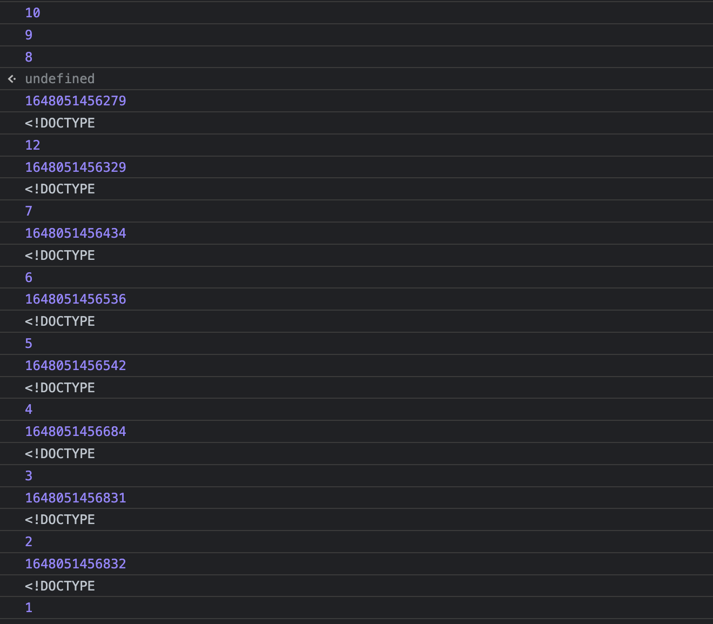

# 前端的并发控制

前两天，大圣老师在群里抛出了这么一个问题，问题如下：

> 请实现如下的函数，可以批量请求数据，所有的 URL 地址在 urls 参数中，同时可以通过 max 参数控制请求的并发度，当所有请求结束之后，需要执行 callback 回调函数。

在尝试了几次以后，自己磕磕绊绊勉强算是实现了这个函数。而后，大圣老师在原基础上提出了另外的问题。所以，今天准备从头整理一下思路，从简单到复杂，依次去实现。

## 问题分析
首先，问题的根本是：需要根据 urls 来发送请求、获取数据、进行处理。
那么，在不考虑并发限制的情况，我们如何去实现呢？
因为 fetch 返回的是一个 promise，所以我们可以使用 Promise.all() 去并行执行任意数量的 promise，那么我们就可以按照如下的方式去做：

```Javascript
  const urls = [/* 若干个 URL */]
  let promises = urls.map(url => fetch(url).then(r => r.text()))
  Promise.all(promises).then(bodies => {/* 处理得到的字符串数组 */})
                       .catch(e => console.error(e))
```

这种实现方式缺点很明显，就是如果 urls 很长的话，一瞬间的并发量就高的可怕了，而且如果其中有请求失败了，那么返回的 promise 也将会被拒绝。

针对上面两个问题，我们可以使用期约链来进行改进。我们一次只请求一个 URL。当该请求返回的时候，我们再进行下一次请求。这样我们就可以避免网络过载。

```Javascript
  function fetchSequentially(urls) {
    // 保存抓取到的数据
    const bodies = []

    // 对单个 URL 进行请求
    function fetchOne(url) {
      return fetch(url)
                .then(response => response.text())
                .then(body => {
                         // 对数据进行处理
                         bodies.push(body)
                       })
    }

    // 创建一个立即兑现的期约作为期约链的开头
    let p = new Promise.resolve(undefined)

    for (url of urls) {
      p = p.then(() => fetchOne(url))
    }

    return p.then(() => bodies)
  }

  fetchSequentially(urls)
      .then(bodies => {/* 处理获取到的数据 */})
      .catch(e => console.error(e))
```

但是这样子一个一个去请求，又导致请求时间过长，所以这就引出了我们一开始提到的问题：需要一个函数，既能批量请求数据，又可以通过 max 参数来控制请求的并发度。

## 并发控制的实现

1. 首先，我们根据传入的 max 来控制当前请求的数量，当每当开始一个请求的时候 max - 1，每当一个请求结束的时候 max + 1。
2. 而当一个请求结束的时候，自动发起另一个请求。
3. 每当一个请求发起时，就从 urls 中取出一个 url，直到 urls 为空

```Javascript
  function sendRequest(urls, max, callback) {
    return new Promise(() => {
      let myFetch = async () => {
        while (max > 0 && urls.length > 0) {
          max--;
          let url = urls.shift()
          fetch(url)
            .then(response => response.text())
            .then(data => {
              callback(data)
              max++;
              myFetch()
            })
        }
      }
      myFetch()
    })
  }

  // 我们可以通过构造下面例子来验证是否成功执行
  // 需要打开对应网页放在里面跑
  let urls = Array(10).fill('https://www.baidu.com')
  let fn = (data) => {
    console.log(Date.now())
    // 只打印前十个字符
    console.log(data.slice(0,10))
  }

  sendRequest(urls, 3, fn)
```

当这个问题被解决以后，大圣老师又对这个问题进行了改造：如果 urls 的请求有优先级的话，应该如何去实现？
我思考了一下，如果传入的 urls 是固定的，那么只需要在内部先对 urls 按照优先级进行排序就好了。但问题肯定不可能这么简单，这个 urls 应该是动态的，当我们在正常请求 urls 时，可能会有新的 url 进来，而这个 url 的优先级会高于还没请求完的 urls。这时，当前序请求结束时，后续请求需要优先对这个优先级高的 url 进行请求。

## 带优先级的并发控制

群里的小伙伴马上就给出了答案：用优先级队列。我一看就知道，问题来了，因为我不会！🤦
那么，什么是优先级队列呢？顾名思义，它首先应该是一个队列，而出队顺序是按照优先级的，优先级最高的，最先出队。

如何实现一个优先级队列呢？最直接、最高效的办法就是用堆来实现。这是因为，堆和优先级队列非常相似。一个堆就可以看作一个优先级队列。很多时候，它们只是概念上的区分而已。往优先级队列中插入一个元素，就相当于往堆中插入一个元素；从优先级队列中取出优先级最高的元素，就相当于取出堆顶元素。但是，JavaScript 中并没有提供优先级队列的实现，所以需要我们自己去实现一个。

首先，我们定义一个优先级队列的类 PriorityQueue，然后实现插入和删除的操作。

```Javascript
class PriorityQueue {
  constructor(max=10) {
    // 用数组存储数据
    this.queue = [null]
    // 记录队列中已存在的个数
    this.count = 0
    // 设置堆可以存储的最大数据个数
    this.max = max
  }

  // 入队操作
  enqueue(element) {
    if (this.count >= this.max) { return -1 }  // 队列已满，入队失败
    this.count = this.count + 1
    this.queue[this.count] = element
    let index = this.count
    let tmp = Math.floor(index / 2)
    while (tmp > 0 && this.queue[index].priority > this.queue[tmp].priority) {
      [this.queue[index], this.queue[tmp]] = [this.queue[tmp], this.queue[index]]
      index = tmp
      tmp = Math.floor(index / 2)
    }
  }

  // 出队操作
  dequeue() {
    if (this.count === 0) { return -1 }  // 队列为空，出队失败
    let element = this.queue[1]
    this.queue[1] = this.queue[this.count]
    delete this.queue[this.count]
    this.count = this.count - 1
    this.heapify(1)
    return element
  }

  // 自上而下进行堆化
  heapify(index) {
    let maxIndex = index
    while (true) {
      if (index*2 <= this.count && this.queue[maxIndex].priority < this.queue[index*2].priority) { maxIndex = index*2 }
      if (index*2+1 <= this.count && this.queue[maxIndex].priority < this.queue[index*2+1].priority) { maxIndex = index*2+1 }
      if (maxIndex === index) { break }
      [this.queue[index], this.queue[maxIndex]] = [this.queue[maxIndex], this.queue[index]]
      index = maxIndex
    }
  }
}
```

上面就是一个简化版的优先级队列。当一个优先级队列实现以后，我们可以对之前的控制并发请求的函数进行一定改造，就可以实现一个依据优先级队列来控制并发请求的函数了。

```JavaScript
  function sendRequest(urls, max, callback) {
    return new Promise(() => {
      let myFetch = async () => {
        while (max > 0 && urls.count > 0) {
          max--;
          let url = urls.dequeue()
          console.log(url.priority)
          fetch(url.value)
            .then(response => response.text())
            .then(data => {
              callback(data)
              max++;
              myFetch()
            })
        }
      }
      myFetch()
    })
  }


  let urls = new PriorityQueue()
  urls.enqueue({value: 'https://www.baidu.com', priority: 7})
  urls.enqueue({value: 'https://www.baidu.com', priority: 4})
  urls.enqueue({value: 'https://www.baidu.com', priority: 9})
  urls.enqueue({value: 'https://www.baidu.com', priority: 1})
  urls.enqueue({value: 'https://www.baidu.com', priority: 6})
  urls.enqueue({value: 'https://www.baidu.com', priority: 3})
  urls.enqueue({value: 'https://www.baidu.com', priority: 2})
  urls.enqueue({value: 'https://www.baidu.com', priority: 5})
  urls.enqueue({value: 'https://www.baidu.com', priority: 8})
  urls.enqueue({value: 'https://www.baidu.com', priority: 10})

  let fn = (data) => {
    console.log(Date.now())
    console.log(data.slice(0,10))
  }

  sendRequest(urls, 3, fn)

  urls.enqueue({value: 'https://www.baidu.com', priority: 12})
```

当我们把代码放进浏览器中去跑，会得到如下结果：



从截图中，我们可以看到，后续添加的优先级最高的请求，先被发送了。


## 参考资料
  1. 《JavaScript权威指南》-- David Flanagan
  2. [文章：字节跳动面试官，我也实现了大文件上传和断点续传 -- 花果山大圣](https://juejin.cn/post/6844904055819468808)
  3. 《数据结构与算法之美》-- 王争
