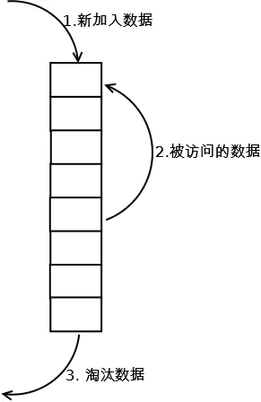

# 基于链表实现 LRU 缓存淘汰算法

LRU 全称 Least Recently Used（最近最少使用），该算法根据数据的历史访问记录来进行淘汰数据，其核心思想是“如果数据最近被访问过，那么将来被访问的几率也更高”。



实现思路是这样的：我们维护一个有序单链表，越靠近链表尾部的节点是越早之前访问的。当有一个新的数据被访问时，我们从链表投开始顺序遍历链表。
1. 如果此数据不在缓存链表中，且缓存未满，则将此节点直接插入到链表的头部
2. 如果此数据不在缓存链表中，但缓存已满，则链表尾节点删除，将新的数据节点插入链表头部
3. 如果此数据已经在缓存中了，我们遍历得到这个数据对应的节点，并将其从原来的位置删除，然后再插入到链表的头部。

话不多说，开干！

1. 首先我们定义一个 Node 节点

```Javascript
// 定义一个链表节点
class Node {
  constructor(val, next){
    this.val = (val===undefined ? 0 : val)
    this.next = (next===undefined ? null : next)
  }
}
```

2. 实现 LRU 逻辑
```Javascript
// 实现一个 LRU 的基本操作
// 1. 插入到链表头部
// 2. 删除链表尾节点
// 3. 断开中间的节点，插入到头部
// LRU 还需要有一个容量

let head = null

let capacity = 10

function LRU(node) {
  let count = 0
  let dummy = { next: head }
  let index = dummy
  while (index && index.next && count < capacity-1) {
    // 如果找到相等的值，就取出该节点，放入链表头部
    if (index.next.val === node.val) {
      let tmp = breakMid(index)
      tmp.next = head
      head = tmp
      return
    }
    index = index.next
    count += 1
  }
  // 如果链表为空，头节点就是该节点
  if (count === 0) { head = node }
  // 如果链表已经满了，就把尾节点删除
  if (count >= capacity-1) {
    index.next = null
  }
  // 在链表中没有找到相同节点，插入链表头部
  node.next = head
  head = node
}
// 断开某个节点，将该节点两头的节点链接起来，并返回断开的节点
function breakMid(node) {
  let tmp = node.next
  node.next = node.next.next
  return tmp
}
```

3. 测试 LRU 的逻辑是否正确
```Javascript
// 塞入 10 个节点
for (let i = 1; i <= capacity; i++) {
  LRU(new Node(i))
}
// 遍历打印出来 
let test = head
while (test) {
  console.log(test.val) // 10,9,8,7,6,5,4,3,2,1
  test = test.next
}

// 再塞入第 11 个节点
LRU(new Node(11))

let test2 = head
while (test2) {
  console.log(test2.val) // 11,10,9,8,7,6,5,4,3,2
  test2 = test2.next
}

// 塞入第 12 个节点，但是该节点已在链表中
LRU(new Node(8))

let test3 = head
while (test3) {
  console.log(test3.val) // 8,11,10,9,7,6,5,4,3,2
  test3 = test3.next
}
```

这样我们就实现了一个基于链表的 LRU 缓存淘汰算法。