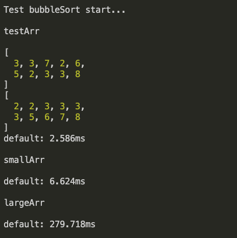
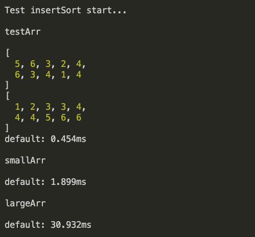
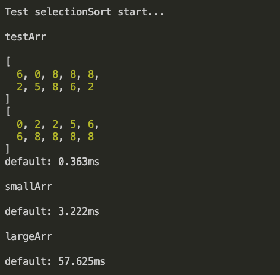
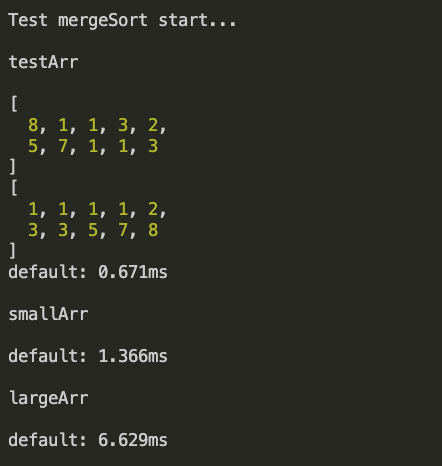
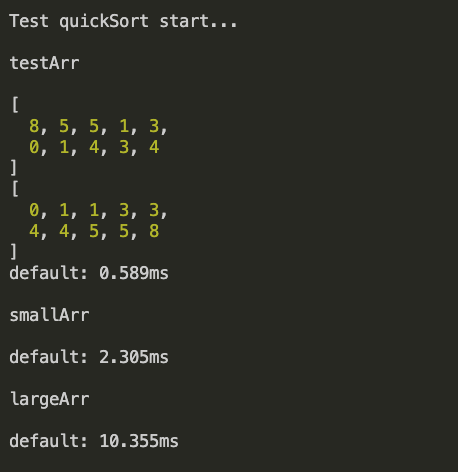

# 常见的排序算法及实现


> 所有文章及相关代码都会上传至我的 GitHub 仓库，地址为：[JayMe_DotDot/myArticle](https://github.com/JayMeDotDot/myArticle)。
> 如果你觉得文章对你有用，欢迎给仓库一个 star⭐️ 或者在掘金点个 赞👍🏻。


我们都知道，常见的排序算法有：冒泡排序、插入排序、选择排序、归并排序、快速排序、桶排序、计数排序、基数排序。
下面我将尝试从定义、复杂度、稳定性以及具体实现来理解上面的各种排序的特点。
测试排序效果的时候使用一组大的数据、一组小的数据，来演示在不同数据量的情况下，排序效果。

### 1. 冒泡排序
  - 概念
  比较相邻两个数据，如果不满足大小要求，就让它们两个交换，直到没有需要交换的元素。一次冒泡会让至少一个元素移动到它应该在的位置，重复 n 次，就完成了 n 个数据的排序工作。

  - 复杂度：空间复杂度 O(1)，时间复杂度 O(n<sup>2</sup>)

  - 稳定性与原地性：原地排序算法、稳定排序算法

  - 具体实现

    ```javascript
    function bubbleSort(arr) {
      const len = arr.length
      
      let flag = false

      for (let c = 0; c < len; c++) {
        flag = false
        for (let i = 0; i < len - 1; i++) {
          // 只有当 i 位数据比 i+1 位数据大时
          // 才进行数据交换，保证排序的稳定性
          if (arr[i] > arr[i+1]) {
            [arr[i], arr[i+1]] = [arr[i+1], arr[i]]
            flag = true
          }
        }
        // 如果遍历过后没有发生数据交换，说明已经是有序的了
        if (!flag) { return }
      }
    }
    ```

  - 测试效果
  

### 2. 插入排序
  - 概念
  将数据分为两个区间，已排序区间和未排序区间。初始已排序区间只有一个元素，就是第一个元素。然后将未排序区间的数据，插入到已排序区间的合适位置，保证已排序区间数据有序。重复这个过程，直到未排序区间元素为空。

  - 复杂度：空间复杂度 O(1), 时间复杂度 O(n<sup>2</sup>)

  - 稳定性与原地性：原地排序算法、稳定排序算法

  - 具体实现

  ```javascript
  function insertSort(arr) {
    if (arr.length < 1) { return }

    for (let i = 1; i < arr.length; i++) {
      let value = arr[i]
      let j = i - 1
      for (; j >= 0; j--) {
        if (arr[j] > value) {
          arr[j+1] = arr[j] // 移动元素
        } else {
          break
        }
      }
      arr[j+1] = value
    }
  }
  ```

  - 测试效果
  

### 3. 选择排序
  - 概念
  其思路类似插入排序，也分已排序区间和未排序区间，但是选择排序每次都会从未排序区间中找到最小的元素，将其放到已排序区间的末尾，且初始已排序区间没有元素。

  - 复杂度：空间复杂度 O(1)，时间复杂度 O(n<sup>2</sup>)

  - 稳定性与原地性：原地排序算法、不稳定排序算法

  - 具体实现

  ```javascript
  function selectionSort(arr) {
  let index = 0
    while (index < arr.length - 1) {
      let minIndex = index
      for (let i = index; i < arr.length; i++) {
        if (arr[i] < arr[minIndex]) {
          minIndex = i
        }
      }
      ;[arr[index], arr[minIndex]] = [arr[minIndex], arr[index]]
      index++
    }
  }
  ```

  - 测试效果
  

### 4. 归并排序
  - 概念
  先把要排序的数据，从中间分成前后两部分，然后对前后两部分分别排序，再将排好序的两部分合并在一起，这样数据就是有序的。利用的是分治思想。

  - 复杂度：空间复杂度 O(n)，时间复杂度 O(nlogn)

  - 稳定性与原地性：非原地排序，稳定排序算法

  - 具体实现

  ```javascript
  function mergeSort(arr) {
    let ans = _mergeSort(arr)
    for (let i = 0; i < ans.length; i++) {
      arr[i] = ans[i]
    }
  }

  function _mergeSort(arr) {
    let len = arr.length
    let m = len >> 1
    if (len <= 1) { return arr }
    let arr1 = _mergeSort(arr.slice(0, m))
    let arr2 = _mergeSort(arr.slice(m))
    return merge(arr1, arr2)
  }

  function merge(arr1, arr2) {
    let l1 = l2 = 0
    let len1 = arr1.length
    let len2 = arr2.length 
    let tmp = []
    while (l1 < len1 && l2 < len2) {
      if (arr1[l1] <= arr2[l2]) {
        tmp.push(arr1[l1])
        l1++
      } else {
        tmp.push(arr2[l2])
        l2++
      }
    }
    if (l1 >= len1) {
      tmp.push(...arr2.slice(l2))
    } else {
      tmp.push(...arr1.slice(l1))
    }
    return tmp
  }
  ```

  - 测试效果
  

### 5. 快速排序
  - 概念
  快速排序使用的也是分治思想。我们将要排序的数组下标从 p 到 r 之间的一组数据，我们选择 p 到 r 之间的任意一个数据作为pivot（分区点）。我们遍历 p 到 r 之间的数据，将小于 pivot 的放到左边，大于 pivot 的放到右边，pivot 放在中间。

  - 复杂度：空间复杂度 O(1)，时间复杂度 O(nlogn)

  - 稳定性与原地性：原地排序算法，非稳定排序算法

  - 具体实现

  ```javascript
  function quickSort(arr) {
    _quickSort(arr, 0, arr.length - 1)
  }

  function _quickSort(arr, left, right) {
    if (left >= right) { return }
    let pivot = partition(arr, left, right)
    _quickSort(arr, left, pivot - 1)
    _quickSort(arr, pivot + 1, right)
  }

  function partition(arr, left, right) {
    let value = arr[right]
    let pivot = left
    for (let i = left; i < right; i++) {
      if (arr[i] < value) {
        ;[arr[i], arr[pivot]] = [arr[pivot], arr[i]]
        pivot++
      }
    }
    ;[arr[right], arr[pivot]] = [arr[pivot], arr[right]]
    return pivot
  }
  ```

  - 测试效果
  


测试案例我使用了

1. 测试样本 -- 10个
2. 小数据量 -- 100个
3. 大数据量 -- 1万个

从上面测试案例可以看出，当数据量变大时，排序速度差距立马就体现出来了。